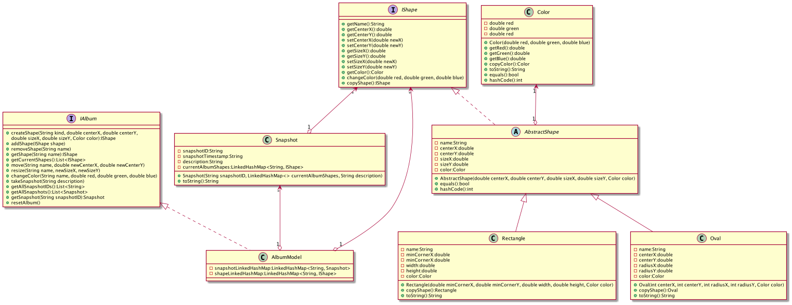

# Shapes Photo Album MVC

In this project a full encompassing MVC design where a model will hold and process the data, a view
to display that data and user interface, and a controller which will control the logic.

## MVC Overview

 

The above image shows an overview of what an MVC design should follow. Below is how I split up
the MVC.

- ### Model
    - AlbumModel
- ### View
    - SwingView
    - SVGView
- ### Controller
    - Controller

## Model

### AlbumModel

AlbumModel will serve as the model part of the MVC and holds the information we need for the
view. Some changes that were implemented were the snapshots could now give more data that would
be necessary to create an accurate view.

## View

### SwingView

This type of view uses Java's Swing package that enables a GUI creation. The GUI displays each
snapshot's ID, description, and shapes at the time of the snapshot. The user can define if they
would like the GUI a certain size by including the width and height in the command line
arguments or a default 1000x1000 size window would be created. The GUI also has buttons to select a
new snapshot and move back and forth between them, as well as a quit button to allow the user to
easily exit the program. When the user clicks a next or previous button a new snapshot is loaded in
and the graphic panel and snapshot ID panel is updated with this new data and repainted. If the user
wants to select a snapshot a list is shown of all snapshots. The user than can select the desired
snapshot and the GUI will be updated.

### SVGView

This type of view uses HTML to allow the user to view all the snapshots on a webpage. Instead of
being able to see one snapshot at a time, all snapshots are included on the webpage but
seperated by a boarder. Each snapshot has the ID, description, timestamp, and shapes on a canvas.
The user can also specify the size of the canvas in command line arguments or a default 
1000x1000 canvas will be created. This type of view was possible by using a string builder to 
create a string that will be placed inside an HTML file either specified by the user or a 
default name would be given. The shapes themselves are displayed using SVG that was created from 
the data from the model.

## Controller

### Controller

This will be the main control of the program deciding which data to be loaded in, how that data 
is processed, and which type of view the data should be represented in. The controller takes the 
text file that is passed in and will scan it for keywords that will be passed to the model for 
the creation and modification of shapes as well as when to take a snapshot. Once all the data 
has been processed and loaded into the model the view will be loaded up with the model to 
process a visual representation of it.

# UML Diagram

Below is a UML diagram for the model class in this project as well as a description of every 
class and there purpose in the model.

We can see in the UML that there are a total of 2 interfaces and 6 classes I was able to see the
design more clearly when it was broken up into 3 different sections.

- Shape
- Snapshot
- Photo Album

## Shapes

In this section I wanted the user to be able to make shapes with specific details.

### IShape:

This would be the interface for the shapes containing all the methods necessary for the model

### AbstractShape:

This would provide the getters and setter for the shape allowing the specific shapes to use this
super class rather than have their own methods. Also, I found having this abstract class allowed me
to have much shorter concrete shape classes and the ability to add more concrete shapes easily.

### Rectangle and Oval:

These are the two concrete shape classes with the program. There is a copyShape() method that allows
the model to get a freeze-frame of the current shape attributes. Also, a toString()
method was added to allow for the shapes to be described more easily.

## Snapshot

This class would act to take a snapshot of the current shapes in the photo album. Included in the
snapshot is a description of the snapshot as well as a unique snapshot ID for all snapshots and a
timestamp for when the snapshot was taken. There is only a constructor and a toString()
method for this class since it really just needs to provide the model with a Snapshot element to be
processed.

## Photo Album

This was the main model that would be doing all the processing of shapes, moving, resizing,
deleting, and snapshots.

### IAlbum:

This serves as the interface for the AlbumModel and contains all the methods that will be used by
the AlbumModel or any model that will implement this interface.

### AlbumModel:

This serves as the concrete model for the photo album. Shapes are able to be created, added, moved,
resized, and have the color changed. Also, when the shapes are added to the photo album this class
will handle the data in a Linked HashMap so that the order of insertion is kept and each shape is
easily found using the name as the key. The class also handles taking the snapshot, getting the IDs,
and handling all the data in a Linked Hash Map once again to maintain order and be able to get any
snapshot using the ID assigned. I decided to use Java's UUID class to assign a unique ID rather than
an extended timestamp. Since my snapshot data was kept in a linked hashmap sometimes the program
would run too fast and would technically have the same key (timestamp) thus overwriting another
snapshot. The photo album can also be reset so that all the snapshots and shapes on the
photo album will be wiped and a fresh photo album can be made.
